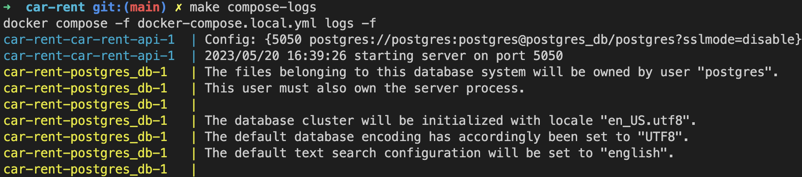
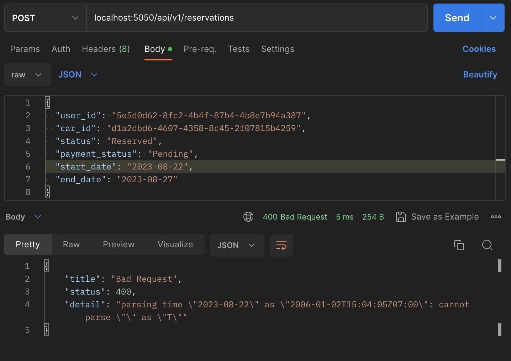

# Car Rent API 🚗

[](https://golang.org/dl/)

## Motivation

This project has been created with a focus on following good practices and building
clean software as for a real application. The project layout was thought to follow the [hexagonal architecture](https://medium.com/@matiasvarela/hexagonal-architecture-in-go-cfd4e436faa3), the endpoints were designed
following REST architecture and you will find features such as the standardization in error responses, testing and management of errors all over the project.

If you want to explore the project you can use [this](https://github.dev/Edigiraldo/car-rent) nice GitHub feature to run a VSCode within this repo as shown below.


## Project Overview

This API is for a car rent system. It allows you to create, delete, update and get users, reservations and
cars. You can also get a list of supported cities. The project is provided with dummy data for you to explore all
available features. Additional features such as authentication are planned to be implemented in the future.

## Instructions

To download the project run:

```console
git clone https://github.com/Edigiraldo/car-rent.git
```

Then, go to the project folder:

```console
cd car-rent
```

Now, run the project with the following command. It should take around 1 minute the first time:

```console
make compose-up
```


The latter will create the containers for the server and database, and now, the API is running
in port 5050. If you want to see the logs you can also run:

```console
make compose-logs
```



If you want to stop the API, you can turn down containers running:

```console
make compose-down
```


## Usage

For the sake of brevity, just some endpoints will be shown here. In the section [Endpoints Overview](#endpoints-overview), you have a description of all endpoints that are implemented in this project.

After following the instructions section to run the api, you can go to [this](http://localhost:5050/api/v1/swagger/index.html) link to use the swagger UI


For simplicity, images will be taken from postman, but all of the endpoints are available in the swagger UI.

The database is filled with dummy data when it is initializated. There, you will find users, cities, cars and reservations. You can retrieve a list of the scheduled reservations within a specified date range, with pagination implemented:


The reservations created are associated to users and cars, have reservation and payment statuses, and start date and end date are set.

You can also get reservations by car id and by user id. Here, we list the reservations made by the first user in the list above. The reservation associated with that user appears as the second entry when searching for their reservations:


You can create users, cars and reservations:


The input for all endpoints is handled. For reservations, the minimum
reservation time is 6 hours, and no car can be reserved twice at the same time:


We attempted to book the car starting from June 5 at 3:16. However, as shown two images above, the car was already reserved by another user since 00:29 on the same day (the second reservation with ID 4ff80974-...) for another user.

Also invalid statuses, uuids or time formats are handled. For example if you try
to book a reservation with an unexpected time format, you will get an error:



Additionally, since reservations are associated with users and cars, when either the user or the car gets deleted, the corresponding reservation is also automatically removed:


Please note that we are using the same user and reservation referenced in the second image of this section where we listed the reservations.

## Testing

The Car Rental API includes unit tests to ensure its functionality. To run the tests, use the following command:

```console
make run-tests
```

## Endpoints Overview

The following is the list of endpoints implemented in this project. The base path ```/api/v1/``` was not included:

### Cars 🚙

- **POST /cars**: Register a new car.
- **GET /cars/**: List cars from a city.
  - Query Parameters:
    - `city`: City name.
    - `from_car_id`: Last seen car ID.
- **GET /cars/{car_id}/reservations**: Get reservations for a specific car.
- **GET /cars/{id}**: Get a car by its UUID.
- **PUT /cars/{id}**: Update a car by its UUID.
- **DELETE /cars/{id}**: Delete a car by its UUID.

### Cities 🌃

- **GET /cities/names**: List the names of all currently supported cities.

### Reservations 📅

- **POST /reservations**: Create a reservation.
- **GET /reservations/**: Get reservations based on query parameters.
  - Query Parameters:
    - `from_reservation_id`: Last seen reservation ID.
    - `start_date`: Start date of the reservation.
    - `end_date`: End date of the reservation.
- **GET /reservations/{id}**: Get a reservation by its UUID.
- **PUT /reservations/{id}**: Update a reservation by its UUID.
- **DELETE /reservations/{id}**: Delete a reservation by its UUID.

### Users 👤

- **POST /users**: Register a new user.
- **GET /users/{id}**: Get a user by their UUID.
- **PUT /users/{id}**: Update a user by their UUID.
- **DELETE /users/{id}**: Delete a user by their UUID.
- **GET /users/{user_id}/reservations**: Get reservations for a specific user by their ID.
